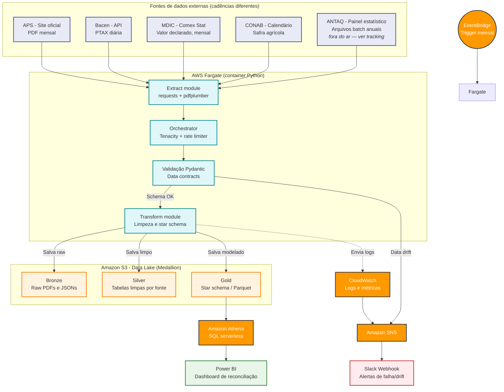

# Comex Data Product: RPA e Serverless AWS Aplicados à Balança Comercial


> Este repositório está em construção pública. Este README é atualizado a cada etapa concluída — não a cada etapa planejada. O que está documentado como "implementado" reflete o código real em execução, validado com dados reais de produção (não apenas amostras).

---

## Navegação
- [Guia de Branches](#guia-de-branches)
- [Status do projeto](#status-do-projeto)
- [Visão geral](#visao-geral)
- [Arquitetura Alvo (Cloud)](#arquitetura-alvo-aws-cloud-native)
- [Fontes de dados](#fontes-de-dados)
- [Modelagem da camada Gold](#modelagem-da-camada-gold)
- [Hipóteses de análise (a validar)](#hipoteses-de-analise-a-validar)
- [Decisões de design aplicadas](#decisoes-de-design-aplicadas)
- [Qualidade de dados e MDM](#qualidade-de-dados-e-mdm)
- [Fontes bloqueadas — tracking](#fontes-bloqueadas--tracking)
- [Governança e uso responsável de dados públicos](#governanca-e-uso-responsavel-de-dados-publicos)
- [Estrutura do projeto](#estrutura-do-projeto)
- [Acompanhando o progresso](#acompanhando-o-progresso)
- [Autor](#autor)

---

## Guia de Branches

Cada branch representa uma etapa isolada de construção. A ordem abaixo é cronológica (da mais antiga para a mais recente), com a data real de atualização e a distância em commits em relação à `main` no momento desta atualização (13/07/2026).

| Branch | Atualizada | Distância de `main` | O que introduziu |
|---|---|---|---|
| `feat/aps-parser` | 30/06/2026 | 27 commits atrás | Extração da tabela "Movimentação de Cargas" do PDF da APS via pdfplumber, incluindo a correção de `vertical_strategy` (`"text"` → `"lines"`) que resolveu a fragilidade de colunas mescladas em meses com números mais largos. |
| `feat/bacen-parser` | 01/07/2026 | 26 commits atrás | Integração com a API Olinda do Banco Central (PTAX), extração e validação da série de câmbio. |
| `feat/gold-layer` | 02/07/2026 | 25 commits atrás | Primeira versão do cruzamento APS + Bacen na camada Gold (tabela fato única). |
| `feat/unit-tests` | 03/07/2026 | 23 commits atrás | Suíte de testes com PDFs reais de meses anteriores como fixtures, cobrindo o parsing ponta a ponta. |
| `feat/observability` | 04/07/2026 | 22 commits atrás | `DateRules` centralizado (regra de defasagem de período) e Zona de Quarentena com os dois circuit breakers (linha e volume/cobertura). |
| `fix/cleaners-and-fixtures` | 05/07/2026 | 20 commits atrás | Ajustes no cleaner da APS decorrentes da migração de estratégia de extração — mapeamento de colunas revisado após a mudança para `"lines"`. |
| `feat/observability-slack` | 06/07/2026 | 13 commits atrás | Conexão do módulo de notificações a um webhook real do Slack. Validado em produção — notificações de sucesso/falha confirmadas em todas as fases do pipeline (extração, transformação e consolidação). |
| `feat/cloud-migration-s3` | 08/07/2026 | 9 commits atrás | Migração de todos os caminhos locais de disco para AWS S3 via `DataLakeConnector` (boto3), cobrindo bronze, silver e gold. Validado com escrita/leitura real no bucket `comex-data-lake-magalhaes-vitor`. |
| `feat/mdic-gold-integration` | 08/07/2026 | 8 commits atrás | Extração e limpeza do Comex Stat (MDIC), com fluxos de exportação e importação separados, e primeira integração à camada Gold. |
| `feat/conab-integration` | 08/07/2026 | 6 commits atrás | Extração do boletim de safra da CONAB (grãos), cleaner com filtro geográfico por UF, e primeira versão do cruzamento agrícola (APS + CONAB) na Gold. |
| `feat/antaq-integration` | 09/07/2026 | 6 atrás / 1 à frente | Extração da ANTAQ iniciada, mas **bloqueada por indisponibilidade da fonte** (não por falha de código). Branch com 1 commit ainda não integrado à `main`. Ver [Fontes bloqueadas — tracking](#fontes-bloqueadas--tracking) para status atualizado e critério de retomada. |
| `feat/gold-integration-master` | 09/07/2026 | 5 commits atrás | Consolidação da camada Gold com todas as fontes disponíveis integradas (APS + Bacen + MDIC + CONAB), gerando as três tabelas fato definitivas e a DDL do Athena. |
| ~~`pipeline-quality-and-mdm`~~ | — | **mergeada na `main`** (branch removida) | Correções de qualidade de dados encontradas em auditoria com dados reais de produção: parâmetro `details` do extrator MDIC sem NCM (código de produto ausente na fonte), coluna `sentido` não populada no Gold por mismatch de nome com `tipo_operacao`, de-para semântico Mercadoria↔Cultura CONAB corrigido e com validação MDM ativa (alerta de chaves órfãs em ambas as direções), correção semântica da alocação geográfica agrícola (share de produção doméstica não é aplicado a fluxos de Importação — fica `NaN` em vez de gerar um número sem sentido), e adição da seção de tracking formal para fontes de dados bloqueadas por terceiros (ver ANTAQ). O merge para `main` foi feito diretamente, sem preservar a branch. |
| `bkp-main-pre-fase3` | 13/07/2026 | 2 commits atrás | Snapshot de segurança da `main`, capturado logo após o merge da `pipeline-quality-and-mdm` e antes do início da Fase 3 (containerização). Preserva o estado da `main` já com as correções de qualidade de dados consolidadas, para permitir rollback rápido caso a infraestrutura como código introduza alguma regressão. Não recebe novos commits de propósito — é um ponto de restauração, não uma frente de trabalho ativa. |
| `feat/historical-backfill` | 13/07/2026 | 2 atrás / 2 à frente | Desacoplamento temporal dos 4 extratores (APS, Bacen, MDIC, CONAB) — cada um passa a aceitar `ano`/`mes` explícitos no construtor, mantendo `DateRules.get_target_period()` como padrão quando nada é informado, sem alterar o comportamento do fluxo mensal já em produção. Novo `backfill_orchestrator.py` reaproveita Bronze→Silver→Gold já validados para rodar em lote mês a mês, com notificação Slack por lote e isolamento de falha por fonte. Novo `discover_backfill_start.py` sonda cada fonte para descobrir o piso histórico real de dado disponível. CONAB ganhou navegação em duas etapas (listagem paginada → subpágina do levantamento → "Tabela de dados") como fallback para meses cujo link direto de `.xlsx` não segue o padrão esperado, além de suporte a `.xls` legado. Camada Gold migrada para tabelas particionadas por `ano` no Athena, com *partition projection* (faixa 2019–2035) para não depender de `MSCK REPAIR TABLE` a cada novo lote de backfill. Esta atualização de README sobe nesta branch. |

---

## Status do projeto

Datas são por número de semana do projeto, não calendário — evita prometer data e atrasar publicamente.

### Fase 1 — Fundação (Concluída)
- [x] Definição do escopo e das fontes de dados
- [x] Diagrama de arquitetura-alvo
- [x] Repositório público com esqueleto de pastas
- [x] Primeiro download funcional do PDF da APS

### Fase 2 — Parsing, Ingestão e Qualidade (Concluída)
- [x] Extração de dados da API Olinda (Banco Central)
- [x] Extração da tabela de "Movimentação de Cargas" via pdfplumber (mapeamento geométrico por linhas de grade)
- [x] Data contract em Pydantic para o schema esperado
- [x] Testes unitários e de integração com PDFs de meses anteriores como fixture
- [x] Centralizar regra de negócio temporal (`DateRules`)
- [x] Implementar Zona de Quarentena com *Circuit Breakers* duplos (Linha e Volume)

### Fase 3 — Resiliência e Observabilidade (Concluída)
- [x] Implementar retry pattern (Tenacity) nos web scrapers e chamadas de API
- [x] Conectar módulo de notificações a um Webhook real do Slack — validado em produção, URL via variável de ambiente
- [x] Garantir códigos de saída (`sys.exit`) corretos para monitoramento de contêineres

### Fase 4 — Data Lake e Camadas (Concluída, exceto ANTAQ)
- [x] Refatorar caminhos locais de disco para AWS S3 (boto3)
- [x] Silver: consolidação do armazenamento limpo no S3 (APS, Bacen, MDIC, CONAB)
- [x] Reconciliação com Comex Stat (MDIC) — incluindo NCM por registro
- [x] Contextualização sazonal com calendário CONAB, com de-para semântico Mercadoria↔Cultura validado (MDM)
- [ ] Comparativo de market share via ANTAQ — **bloqueado por fonte externa indisponível, não por limitação técnica do pipeline**. Detalhamento completo, com datas de checagem, em [Fontes bloqueadas — tracking](#fontes-bloqueadas--tracking).
- [x] Gold: cruzamento das fontes e modelo dimensional — três tabelas fato em produção (`fato_movimentacao_cambio`, `fato_balanca_mdic`, `fato_origem_agricola`)
- [x] Consulta via Amazon Athena — DDL aplicada para as três tabelas fato

### Fase 5 — Infraestrutura como código (Em andamento)
- [ ] Containerizar os pipelines com Docker
- [ ] Deploy serverless no AWS ECS / Fargate (com gatilho EventBridge)
- [ ] Provisionamento via AWS SAM dos recursos validados

> Nota: o pipeline hoje já roda ponta a ponta (extração → limpeza → Gold → S3 → notificação Slack) via `orchestrator.py`, mas ainda de forma local/manual — a containerização e o agendamento serverless são o próximo salto de maturidade operacional, não um bloqueador para geração de dados.

### Fase 6 — Backfill Histórico (Concluída)
- [x] Desacoplar os 4 extratores da regra `DateRules.get_target_period()`, permitindo instanciá-los com `ano`/`mes` arbitrários sem quebrar o fluxo mensal padrão
- [x] `discover_backfill_start.py` — diagnóstico que sonda cada fonte (2015–2020) para encontrar o primeiro período com dado real e calcular o piso comum de backfill
- [x] `backfill_orchestrator.py` — motor que roda Bronze→Silver→Gold em lote, mês a mês, com notificação de sucesso/falha por lote e tratamento de ausência de boletim da CONAB como caso esperado (não como falha)
- [x] Fallback de navegação em duas etapas para a CONAB (listagem paginada → levantamento → "Tabela de dados"), cobrindo meses em que o link direto de `.xlsx` não segue o padrão de nome esperado, e suporte a planilhas `.xls` legadas
- [x] Camada Gold reestruturada no Athena com tabelas particionadas por `ano` e *partition projection* (2019–2035), eliminando a necessidade de `MSCK REPAIR TABLE` a cada lote novo
- [x] Execução real do backfill completo (2019 até o presente)

### Fase 7 — Entrega (Roadmap)
- [ ] Dashboard Power BI
- [ ] Case study final e retrospectiva

---

## Visão geral

Este projeto pretende resolver um problema real de Comércio Exterior (Comex): **reconciliar** o que o Porto de Santos registra fisicamente (toneladas movimentadas) com o que a alfândega (MDIC) registra financeiramente (valor FOB em USD), contextualizando esses números pela sazonalidade da safra (CONAB) e pela variação cambial (Bacen).

Para isso, foi construído um pipeline de engenharia de dados e RPA que extrai dados não-estruturados de PDFs públicos, enriquece com APIs governamentais e consolida os resultados em um data lake estruturado (arquitetura medallion) na AWS.

Todos os dados usados são reais e públicos — nenhum dado é simulado ou inventado. A camada Gold já processa volumes de produção reais (ex.: mais de 117 mil registros do Comex Stat em um único mês de referência).

---

## Arquitetura alvo (AWS Cloud-Native)

*Esta é a arquitetura planejada. O status de implementação de cada componente está na seção [Status do projeto](#status-do-projeto).*



**Stack planejada:**
- Orquestração: Amazon EventBridge (gatilho mensal, ECS RunTask direto — sem Lambda)
- Processamento: AWS Fargate, em subnet pública sem NAT Gateway
- Data lake (S3 medallion): bronze, silver, gold — **em produção**
- Consulta: Amazon Athena — **DDL aplicada**
- Observabilidade: Amazon SNS + Slack — **Slack em produção**; SNS/CloudWatch ainda roadmap
- IaC: AWS SAM (Terraform descartado por complexidade de configuração desproporcional ao escopo)

---

## Fontes de dados

| Fonte | O que fornece | Cadência | Formato de acesso | Status |
|---|---|---|---|---|
| Autoridade Portuária de Santos (APS) | Volume físico (toneladas) por mercadoria e sentido (Importação/Exportação) | Mensal | PDF (Mensário Estatístico) | Em produção |
| Banco Central (Bacen) | PTAX (câmbio) | Diária | API pública (SGS/OData) — não requer chave de autenticação | Em produção |
| Comex Stat (MDIC) | Valor FOB (USD) e NCM declarados na alfândega, por fluxo (export/import) | Mensal | API REST (`api-comexstat.mdic.gov.br`) | Em produção |
| CONAB | Produção agrícola por estado (safra de grãos) | Sazonal | Planilha `.xlsx` (boletim mensal) | Em produção — cobre apenas Soja, Milho, Trigo, Arroz e Feijão |
| ANTAQ | Estatísticas de movimentação de todos os portos | Anual | Painel estatístico (Qlik Sense) com download de arquivos compactados — não é uma API REST simples | **Bloqueado por indisponibilidade da fonte** — ver [tracking](#fontes-bloqueadas--tracking) |

---

## Modelagem da camada Gold

A camada Gold hoje é composta por **três tabelas fato**, cada uma consultável via Athena (DDL em `athena_ddl.sql`):

- **`fato_movimentacao_cambio`** — volume físico por mercadoria e sentido (APS), enriquecido com PTAX média do período (Bacen).
- **`fato_balanca_mdic`** — valor declarado por NCM e fluxo (MDIC), convertido para BRL usando a PTAX média do mesmo período.
- **`fato_origem_agricola`** — cruzamento entre volume físico da APS e produção por estado (CONAB), via de-para semântico Mercadoria↔Cultura, com alocação geográfica estimada (`volume_toneladas_estimado`) — aplicável apenas ao fluxo de Exportação, por construção.

Star schema com dimensões separadas (`dim_date`, `dim_commodity`, `dim_port`, `dim_currency`) ainda não implementado — hoje as três tabelas são fatos já enriquecidos, sem normalização em dimensões. Fica como evolução de modelagem, não bloqueador para consulta.

Objetivo: responder perguntas como *"qual o volume médio de soja exportada por Santos nos meses de pico de safra, ajustado pela variação do dólar?"* ou *"qual a divergência entre o valor FOB declarado por NCM e o volume físico movimentado no mesmo período?"* com queries SQL simples no Athena.

---

## Hipóteses de análise (a validar)

Estas são hipóteses que o pipeline vai testar quando houver dados suficientes — não conclusões já demonstradas.

- **H1 — Sazonalidade domina o câmbio no curto prazo:** a expectativa, baseada na literatura de comércio exterior, é que o volume de exportação portuária seja tracionado principalmente pelo calendário de colheita, com o efeito cambial defasado e de menor magnitude. Isso será testado cruzando volume mensal com o calendário CONAB e a série de PTAX, e só será tratado como conclusão depois de série histórica suficiente (referência: 24+ meses).
- **H2 — Divergência físico x financeiro:** espera-se que o volume físico (APS) e o valor declarado (Comex Stat) divirjam de forma explicável por preço de commodity e mix de produto, não por erro de dado. O painel de reconciliação vai quantificar essa diferença, não vai tratá-la como uma inconsistência a "corrigir". Testável agora que o NCM está presente em 100% dos registros do `fato_balanca_mdic` — antes disso, essa hipótese não tinha como ser validada por produto.

---

## Decisões de design aplicadas

> **PDF vs. portal tabular da APS**
> A APS também disponibiliza dados tabulares além do PDF. A opção pelo PDF (pdfplumber) é deliberada: demonstra parsing resiliente a mudança de layout, competência mais próxima de cenários reais de Market Intelligence, onde fontes valiosas raramente têm API amigável.

> **Extração geométrica em vez de posicional**
> A extração inicial usava `vertical_strategy: "text"`, que infere colunas pela posição horizontal do texto. Essa abordagem se mostrou frágil: números mais largos (típicos de totais acumulados ao longo do ano) deslocam a inferência de coluna e corrompem linhas inteiras — inclusive a linha `TOTAL GERAL`, usada pelo Circuit Breaker de Volume. A correção migrou para `vertical_strategy: "lines"`, que usa as linhas de grade reais do PDF, eliminando a dependência da largura do número.

> **Resiliência via Pydantic**
> A extração de PDF está sujeita a mudança de layout sem aviso. Pydantic funciona como contrato de dados: se a estrutura extraída não bater com o schema esperado, o dado é bloqueado antes da camada Silver e um alerta é disparado — em vez de deixar dado ruim propagar silenciosamente.

> **Quarentena com Circuit Breaker duplo**
> Um único breaker por contagem de linhas rejeitadas não protege contra a perda de poucas linhas de alto peso (ex: Soja, Açúcar). Por isso, a validação combina dois critérios independentes — taxa de linhas rejeitadas e taxa de cobertura de volume (toneladas validadas vs. total oficial do documento) — e bloqueia a ingestão se qualquer um dos dois for violado. Ausência do total oficial no documento é tratada como falha estrutural (fail-closed), não como validação ignorada.

> **De-para semântico em vez de join por string exata**
> O nome de uma mercadoria na APS raramente é idêntico ao nome de uma cultura na CONAB ("Farelo de Soja" vs. "Soja", por exemplo). Um `inner join` direto por texto descartava silenciosamente produtos agrícolas legítimos. A solução foi um dicionário de referência versionado (`mercadoria_cultura_map.csv`) com uma chave semântica explícita, mais um alerta de MDM que compara as culturas do de-para contra as culturas realmente presentes na Silver da CONAB — pegando tanto mercadorias sem mapa quanto mapas apontando para uma cultura que não existe (ou mudou de nome) na fonte.

> **Alocação geográfica não se aplica à Importação**
> O `share_estado` é calculado a partir da produção doméstica (CONAB) e só é semanticamente válido para o fluxo de Exportação — ele representa "de qual estado brasileiro veio o produto que saiu por Santos". Aplicado à Importação, o resultado seria uma origem geográfica fisicamente impossível (produto importado não nasce em produção doméstica). Por isso, `volume_toneladas_estimado` fica `NaN` para registros de Importação, preservando o volume físico real (`volume_toneladas`) sem inventar uma origem que a fonte não sustenta.

> **AWS SAM em vez de Terraform**
> Terraform foi descartado para este escopo por complexidade de configuração desproporcional ao tamanho do projeto (solo, poucos recursos). SAM cobre o necessário com menos sobrecarga operacional.

> **Ignorar fonte indisponível em vez de bloquear a entrega**
> Quando uma fonte de terceiros fica indisponível (ver ANTAQ), a decisão de design é não bloquear o pipeline nem as demais fontes por causa dela. A branch de integração fica isolada (`feat/antaq-integration`), sem merge na `main`, e o restante do Gold segue sendo publicado normalmente. O acompanhamento da indisponibilidade é feito à parte, com data de verificação registrada, para não misturar "dado não disponível hoje" com "funcionalidade não implementada".

> **Desacoplamento temporal em vez de duplicar extratores para o backfill**
> Em vez de criar uma versão paralela de cada extrator para rodar em períodos passados, os 4 extratores (`ano`/`mes` no construtor) passaram a aceitar o período como parâmetro explícito, caindo para `DateRules.get_target_period()` apenas quando nada é informado. Isso significa que o mesmo código que roda o pipeline mensal em produção (`orchestrator.py`) é o que roda o backfill histórico (`backfill_orchestrator.py`) — qualquer correção feita num extrator vale automaticamente para os dois fluxos, sem risco de divergência entre "a versão que roda todo mês" e "a versão que roda uma vez para o histórico".

> **Descoberta do piso histórico em vez de um valor de calendário arbitrário**
> `BACKFILL_START` em `backfill_orchestrator.py` não foi escolhido por suposição — `discover_backfill_start.py` sonda cada fonte mês a mês (2015–2020) para achar o primeiro período em que ela responde com dado válido, e o início comum do backfill é o `max` entre esses pisos e um piso de segurança de negócio (`FLOOR_MINIMO`, hoje 2019-01). Isso evita tanto começar cedo demais (gerando lotes vazios/erros para fontes que ainda não existiam) quanto começar tarde demais por excesso de cautela.

> **Ausência de boletim da CONAB não é falha de pipeline**
> Diferente das outras três fontes, a CONAB nem sempre publica boletim para todo mês do intervalo de backfill. `backfill_orchestrator.py` trata a ausência de boletim da CONAB como comportamento esperado (loga e segue o lote), reservando o registro de falha real para quando a fonte responde mas o dado não pode ser processado — evita que o backfill pare ou dispare alertas de erro para um caso que não é, de fato, um erro.

> **Navegação em duas etapas como fallback da CONAB, não como substituição**
> O casamento direto por regex do nome do arquivo (`find_xlsx_url`) continua sendo a primeira tentativa por ser mais rápido; só quando ele falha o extrator cai para `find_xlsx_url_via_navegacao`, que percorre listagem paginada → subpágina do levantamento → link "Tabela de dados". Meses mais antigos têm maior chance de fugir do padrão de nome de arquivo usado atualmente pela CONAB, e esse fallback existe especificamente para não deixar o backfill perder meses só por causa de uma convenção de nomenclatura que mudou ao longo do tempo.

> **Partition projection em vez de `MSCK REPAIR TABLE` manual**
> Com o backfill introduzindo potencialmente dezenas de novas partições anuais na Gold, repetir `MSCK REPAIR TABLE` a cada lote seria um passo manual repetitivo e fácil de esquecer. As três tabelas fato foram reestruturadas para particionar por `ano` com *partition projection* do Athena, numa faixa fixa (2019–2035) — o Athena calcula as partições existentes em tempo de consulta, sem precisar de um passo de descoberta explícito a cada nova carga.

---

## Qualidade de dados e MDM

Esta seção documenta limitações conhecidas e mecanismos de validação ativos na camada Gold — não é uma lista de bugs, é o contrato de confiabilidade dos dados publicados.

- **Cobertura do de-para agrícola:** o dicionário `mercadoria_cultura_map.csv` cobre apenas culturas do Boletim da Safra de Grãos da CONAB (Soja, Milho, Trigo, Arroz, Feijão). Mercadorias agrícolas fora desse escopo — como Açúcar, Álcool e Sucos Cítricos — não têm fonte de produção mapeada e ficam de fora do `fato_origem_agricola` até que um extrator dedicado a cana-de-açúcar/citros seja implementado. Isso é logado explicitamente a cada execução (`Mercadorias possivelmente agrícolas sem chave no 'De-Para'`), não falha silenciosamente.
- **Alerta de MDM ativo:** toda execução do Gold Builder valida se as culturas referenciadas no de-para realmente existem na Silver da CONAB no período processado, e alerta em caso de divergência — protegendo contra o de-para e o cleaner da CONAB divergirem de nome ao longo do tempo sem que ninguém perceba.
- **Modelo de alocação geográfica é uma estimativa, não um rastreamento real:** `volume_toneladas_estimado` assume que a proporção de produção nacional por estado reflete a proporção de origem do que passa por Santos — não captura gargalos logísticos reais (ex.: estados de fronteira agrícola distantes de Santos). Tratar como indicador direcional, não como dado de rastreabilidade logística.
- **NCM disponível desde a integração com o Comex Stat:** o parâmetro `details` da API do MDIC precisa incluir explicitamente o detalhamento por produto — sem isso, os registros vêm agregados só por país, sem chave de produto utilizável.

---

## Fontes bloqueadas — tracking

Esta seção existe para separar duas coisas que parecem iguais no roadmap mas não são: **funcionalidade não implementada** (responsabilidade do projeto) e **fonte de terceiros indisponível** (fora do controle do projeto). Cada item bloqueado por fonte externa é registrado aqui com data de descoberta, prazo declarado pela fonte (se houver) e data da última checagem — para que "bloqueado" nunca vire sinônimo de "esquecido".

### ANTAQ — Painel Estatístico Aquaviário (Qlik Sense)

| Campo | Valor |
|---|---|
| Status | 🔴 Indisponível |
| Descoberto em | 08/07/2026 (durante `feat/antaq-integration`) |
| Aviso oficial da fonte | Publicado em 23/06/2026, atualizado em 29/06/2026 |
| Prazo declarado pela ANTAQ | "Até 10/07" (manutenção técnica) |
| Última checagem | 13/07/2026 — painel segue indisponível, aviso não foi atualizado desde 29/06 |
| Impacto no escopo | Bloqueia apenas o comparativo de market share entre portos (item da Fase 4). Não afeta nenhuma das três tabelas fato já em produção. |
| Ação atual | Nenhuma retentativa automática; branch `feat/antaq-integration` permanece isolada da `main`. Retomada é decisão manual após confirmação de disponibilidade. |

**Observação sobre o tipo de indisponibilidade:** há indício de que este não seja um caso de manutenção simples — fontes do setor portuário vêm noticiando uma **atualização de versão do Painel Estatístico Aquaviário** prevista para entrar em produção a partir de julho/2026 (nova navegação, filtros fixos, unidade adicional de TKU). Se for esse o caso, o retorno do sistema provavelmente virá acompanhado de uma nova estrutura de página/dashboard, e o extrator planejado para `feat/antaq-integration` pode precisar ser refeito (não apenas reativado) quando a fonte voltar.

**Alternativas avaliadas para essa lacuna, caso a indisponibilidade se estenda:**
- **Base dos Dados** (`basedosdados.org`) — hospeda o Anuário Estatístico da ANTAQ já tratado, consultável via SQL/Python/BigQuery, sem dependência de scraping de Qlik Sense. Granularidade anual, não mensal.
- **Boletim Estatístico Aquaviário (PDF)**, publicado periodicamente pela própria ANTAQ em "Estudos e Pesquisas" — reaproveitaria a mesma competência de parsing de PDF já validada no `aps_extractor.py`.
- **Plano de Dados Abertos (PDA) da ANTAQ** — a checar se há CSV/XLSX de download direto, sem depender do painel interativo.

Nenhuma dessas alternativas foi integrada ainda. A decisão até o momento é não trocar de fonte no meio do projeto sem necessidade comprovada — o escopo core (reconciliação APS × MDIC × CONAB × Bacen) já é entregue de ponta a ponta sem o dado da ANTAQ, que era um enriquecimento (comparativo de market share), não uma dependência estrutural da camada Gold.

---

## Governança e uso responsável de dados públicos

Todas as fontes usadas são públicas e institucionais (APS, Bacen, MDIC, CONAB, ANTAQ). A extração segue princípios de coleta responsável:
- Respeito ao `robots.txt` e aos termos de uso de cada site.
- Rate limiting explícito entre requisições (sem paralelismo agressivo).
- Retries com backoff (Tenacity), não repetição imediata em caso de erro.
- Nenhuma técnica de evasão de proteção anti-bot — a coleta é transparente e auditável, adequada ao caráter público das fontes.

---

## Estrutura do projeto

```bash
comex-data-product/
├── orchestrator.py              # Executa o pipeline ponta a ponta (Bronze → Silver → Gold) para o mês vigente
├── backfill_orchestrator.py     # Roda o pipeline em lote, mês a mês, para o histórico (2019 → presente)
├── discover_backfill_start.py   # Diagnóstico: sonda cada fonte e calcula o piso histórico comum de backfill
├── src/
│   ├── extractors/
│   │   ├── aps_extractor.py
│   │   ├── bacen_extractor.py
│   │   ├── mdic_extractor.py
│   │   └── conab_extractor.py
│   ├── transformers/
│   │   ├── aps_cleaner.py
│   │   ├── bacen_cleaner.py
│   │   ├── mdic_cleaner.py
│   │   ├── conab_cleaner.py
│   │   └── gold_builder.py
│   ├── models/
│   │   └── contracts.py
│   ├── reference/
│   │   └── mercadoria_cultura_map.csv   # De-para semântico Mercadoria (APS) ↔ Cultura (CONAB)
│   └── utils/
│       ├── date_rules.py
│       ├── quarantine.py
│       ├── storage.py            # DataLakeConnector (S3/local)
│       └── notifier.py
├── tests/
│   ├── fixtures/aps/
│   ├── test_extractors.py
│   ├── test_contracts.py
│   └── test_cleaners.py
├── data/
│   ├── bronze/
│   ├── silver/
│   ├── gold/
│   └── quarantine/              # zona irmã, não subpasta da silver
├── sql/
│   ├── athena_ddl.sql
│   └── business_queries.sql      # DDL das três tabelas fato (Athena)
├── template.yaml
├── .env.example
└── requirements.txt
```

---

## Acompanhando o progresso

Este projeto está sendo construído em público, com atualizações regulares no LinkedIn a cada fase concluída (não a cada intenção). Comentários e sugestões são bem-vindos — toda sugestão é avaliada contra o roadmap antes de entrar no escopo.

- LinkedIn: [linkedin.com/in/magalhaes-vitor](https://www.linkedin.com/in/magalhaes-vitor/)

---

## Autor

**Vitor De Toledo Magalhães**
Desenvolvedor Python | Especialista em Automação (RPA) | Engenharia de Dados Cloud

- LinkedIn: [linkedin.com/in/magalhaes-vitor](https://www.linkedin.com/in/magalhaes-vitor/)
- GitHub: [github.com/Magalhaes-vitor](https://github.com/Magalhaes-vitor)
- E-mail: vitor.de.toledo.magalhaes@gmail.com