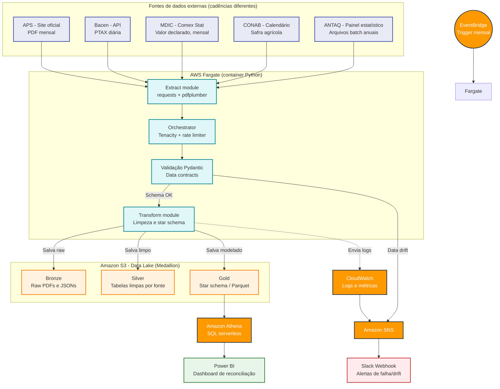

# Comex Data Product: RPA e Serverless AWS Aplicados à Balança Comercial


> Este repositório está em construção pública. Este README é atualizado a cada etapa concluída — não a cada etapa planejada. Se uma seção está marcada como "alvo", ainda não foi implementada.

---

## Navegação
- [Status do projeto](#-status-do-projeto)
- [Visão geral](#-visão-geral)
- [Arquitetura alvo](#-arquitetura-alvo-aws-cloud-native)
- [Fontes de dados](#-fontes-de-dados)
- [Modelagem planejada da camada Gold](#-modelagem-planejada-da-camada-gold-star-schema)
- [Hipóteses de análise (a validar)](#-hipóteses-de-análise-a-validar)
- [Decisões de design já tomadas](#-decisões-de-design-já-tomadas)
- [Governança e uso responsável de dados públicos](#-governança-e-uso-responsável-de-dados-públicos)
- [Estrutura planejada do projeto](#-estrutura-planejada-do-projeto)
- [Acompanhando o progresso](#-acompanhando-o-progresso)
- [Autor](#-autor)

---

## Status do projeto

**Fase atual: planejamento e desenho de arquitetura (semana 1-2 de 12).**

Nada neste checklist é assumido como pronto até estar marcado. Datas são por número de semana do projeto, não calendário — evita prometer data e atrasar publicamente.

### Fase 1 — Fundação (semanas 1-2)
- [x] Definição do escopo e das fontes de dados
- [x] Diagrama de arquitetura-alvo
- [x] Repositório público com esqueleto de pastas
- [ ] Primeiro download funcional do PDF da APS (sem parsing ainda)

### Fase 2 — Parsing e ingestão (semanas 3-5)
- [ ] Extração da tabela de "Movimentação de Cargas" via pdfplumber/camelot
- [ ] Data contract em Pydantic para o schema esperado
- [ ] Testes unitários com PDFs de meses anteriores como fixture
- [ ] Integração com a API do Bacen (PTAX)

### Fase 3 — Data lake e camadas (semanas 6-7)
- [ ] Bronze: armazenamento de PDFs e JSONs brutos no S3
- [ ] Silver: dados limpos e validados, uma tabela por fonte
- [ ] Gold: cruzamento das fontes e modelo dimensional (star schema)
- [ ] Consulta via Amazon Athena

### Fase 4 — Resiliência e observabilidade (semana 8)
- [ ] Alertas de falha/drift via SNS + Slack
- [ ] Retries com Tenacity e rate limiting

### Fase 5 — Infraestrutura como código (semana 9)
- [ ] Provisionamento via AWS SAM ou Terraform dos recursos já validados manualmente

### Fase 6 — Profundidade analítica (semana 10)
- [ ] Reconciliação com Comex Stat (MDIC)
- [ ] Contextualização sazonal com calendário CONAB
- [ ] Comparativo de market share via ANTAQ (dados batch anuais — ver nota na seção de fontes)

### Fase 7 — Entrega (semanas 11-12)
- [ ] Dashboard Power BI
- [ ] Case study final e retrospectiva

---

## Visão geral

Este projeto pretende resolver um problema real de Comércio Exterior (Comex): **reconciliar** o que o Porto de Santos registra fisicamente (toneladas movimentadas) com o que a alfândega (MDIC) registra financeiramente (valor FOB em USD), contextualizando esses números pela sazonalidade da safra (CONAB) e pela variação cambial (Bacen).

Para isso, será construído um pipeline de engenharia de dados e RPA que extrai dados não-estruturados de PDFs públicos, enriquece com APIs governamentais e consolida os resultados em um data lake estruturado (arquitetura medallion) na AWS, orquestrado de forma serverless.

Todos os dados usados são reais e públicos — nenhum dado é simulado ou inventado.

---

## Arquitetura alvo (AWS Cloud-Native)

*Esta é a arquitetura planejada. O status de implementação de cada componente está na seção [Status do projeto](#-status-do-projeto).*



**Stack planejada:**
- Orquestração: Amazon EventBridge (gatilho mensal)
- Processamento: AWS Fargate
- Data lake (S3 medallion): bronze, silver, gold
- Consulta: Amazon Athena
- Observabilidade: Amazon SNS + Slack
- IaC: AWS SAM

---

## Fontes de dados

| Fonte | O que fornece | Cadência | Formato de acesso |
|---|---|---|---|
| Autoridade Portuária de Santos (APS) | Volume físico (toneladas) por mercadoria | Mensal | PDF (Mensário Estatístico) |
| Banco Central (Bacen) | PTAX (câmbio) | Diária | API pública (SGS/OData) — **não requer chave de autenticação** |
| Comex Stat (MDIC) | Valor FOB (USD) declarado na alfândega | Mensal | Consulta/download estruturado |
| CONAB | Calendário de safra agrícola | Sazonal | Boletins/planilhas |
| ANTAQ | Estatísticas de movimentação de todos os portos | Anual | Painel estatístico (Qlik Sense) com download de arquivos compactados — **não é uma API REST simples**, exige um mini-ETL de arquivo batch |

---

## Modelagem planejada da camada Gold (Star Schema)

*Ainda não implementada. Desenho alvo:*

- **Tabela fato:** `fact_exports` — volume (toneladas), valor FOB (USD), taxa PTAX aplicada na data do embarque.
- **Dimensões:**
  - `dim_date` — dia útil, mês de safra (CONAB), trimestre.
  - `dim_commodity` — produtos e categorias.
  - `dim_port` — porto de origem e região.
  - `dim_currency` — metadados da taxa de câmbio.

Objetivo: responder perguntas como *"qual o volume médio de soja exportada por Santos nos meses de pico de safra, ajustado pela variação do dólar?"* com queries SQL simples no Athena.

---

## Hipóteses de análise (a validar)

Estas são hipóteses que o pipeline vai testar quando houver dados suficientes — não conclusões já demonstradas.

- **H1 — Sazonalidade domina o câmbio no curto prazo:** a expectativa, baseada na literatura de comércio exterior, é que o volume de exportação portuária seja tracionado principalmente pelo calendário de colheita, com o efeito cambial defasado e de menor magnitude. Isso será testado cruzando volume mensal com o calendário CONAB e a série de PTAX, e só será tratado como conclusão depois de série histórica suficiente (referência: 24+ meses).
- **H2 — Divergência físico x financeiro:** espera-se que o volume físico (APS) e o valor declarado (Comex Stat) divirjam de forma explicável por preço de commodity e mix de produto, não por erro de dado. O painel de reconciliação vai quantificar essa diferença, não vai tratá-la como uma inconsistência a "corrigir".

---

## Decisões de design já tomadas

> **PDF vs. portal tabular da APS**
> A APS também disponibiliza dados tabulares além do PDF. A opção pelo PDF (pdfplumber/camelot) é deliberada: demonstra parsing resiliente a mudança de layout, competência mais próxima de cenários reais de Market Intelligence, onde fontes valiosas raramente têm API amigável.

> **Resiliência via Pydantic**
> A extração de PDF está sujeita a mudança de layout sem aviso. Pydantic funciona como contrato de dados: se a estrutura extraída não bater com o schema esperado, o dado é bloqueado antes da camada Silver e um alerta é disparado — em vez de deixar dado ruim propagar silenciosamente.

---

## Governança e uso responsável de dados públicos

Todas as fontes usadas são públicas e institucionais (APS, Bacen, MDIC, CONAB, ANTAQ). A extração segue princípios de coleta responsável:
- Respeito ao `robots.txt` e aos termos de uso de cada site.
- Rate limiting explícito entre requisições (sem paralelismo agressivo).
- Retries com backoff (Tenacity), não repetição imediata em caso de erro.
- Nenhuma técnica de evasão de proteção anti-bot — a coleta é transparente e auditável, adequada ao caráter público das fontes.

---

## Estrutura planejada do projeto

```bash
comex-data-product/
├── src/
│   ├── extractors/
│   │   ├── aps_extractor.py
│   │   ├── bacen_extractor.py
│   │   └── mdic_extractor.py
│   ├── transformers/
│   │   ├── cleaner.py
│   │   └── gold_builder.py
│   ├── models/
│   │   ├── contracts.py
│   │   └── validators.py
│   ├── orchestrator.py
│   └── utils/
├── tests/
│   ├── fixtures/
│   ├── test_extractors.py
│   └── test_contracts.py
├── template.yaml
├── .env.example
└── requirements.txt
```

---

## Acompanhando o progresso

Este projeto está sendo construído em público, com atualizações regulares no LinkedIn a cada fase concluída (não a cada intenção). Comentários e sugestões são bem-vindos — toda sugestão é avaliada contra o roadmap antes de entrar no escopo.

- LinkedIn: [linkedin.com/in/magalhaes-vitor](https://www.linkedin.com/in/magalhaes-vitor/)

---

## Autor

**Vitor De Toledo Magalhães**
Desenvolvedor Python | Especialista em Automação (RPA) | Engenharia de Dados Cloud

- LinkedIn: [linkedin.com/in/magalhaes-vitor](https://www.linkedin.com/in/magalhaes-vitor/)
- GitHub: [github.com/Magalhaes-vitor](https://github.com/Magalhaes-vitor)
- E-mail: vitor.de.toledo.magalhaes@gmail.com