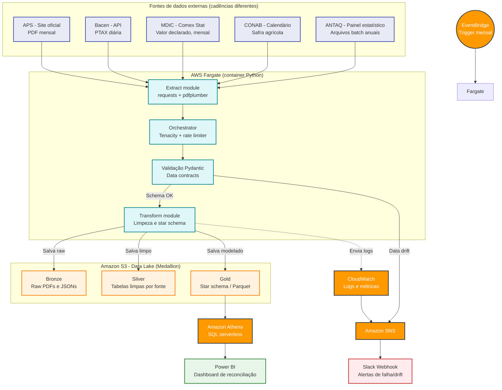

# Comex Data Product: RPA e Serverless AWS Aplicados à Balança Comercial


> Este repositório está em construção pública. Este README é atualizado a cada etapa concluída — não a cada etapa planejada. O que está documentado como "implementado" reflete o código real em execução.

---

## Navegação
- [Guia de Branches](#guia-de-branches)
- [Status do projeto](#status-do-projeto)
- [Visão geral](#visao-geral)
- [Arquitetura Alvo (Cloud)](#arquitetura-alvo-aws-cloud-native)
- [Fontes de dados](#fontes-de-dados)
- [Modelagem da camada Gold](#modelagem-da-camada-gold)
- [Hipóteses de análise (a validar)](#hipoteses-de-analise-a-validar)
- [Decisões de design aplicadas](#decisoes-de-design-aplicadas)
- [Governança e uso responsável de dados públicos](#governanca-e-uso-responsavel-de-dados-publicos)
- [Estrutura do projeto](#estrutura-do-projeto)
- [Acompanhando o progresso](#acompanhando-o-progresso)
- [Autor](#autor)

---

## Guia de Branches

Cada branch representa uma etapa isolada de construção — este é o guia de alterações do projeto. A ordem abaixo é cronológica (da mais antiga para a mais recente). Descrição inferida a partir do nome da branch e do histórico de decisões do projeto; ajuste se o conteúdo real divergir.

| Branch | Commits | Última atualização | O que introduziu |
|---|---|---|---|
| `feat/aps-parser` | 15 | há 2 dias | Extração da tabela "Movimentação de Cargas" do PDF da APS via pdfplumber, incluindo a correção de `vertical_strategy` (`"text"` → `"lines"`) que resolveu a fragilidade de colunas mescladas em meses com números mais largos. |
| `feat/bacen-parser` | 14 | há 2 dias | Integração com a API Olinda do Banco Central (PTAX), extração e validação da série de câmbio. |
| `feat/gold-layer` | 13 | há 2 dias | Cruzamento das fontes (APS + Bacen) e construção da tabela fato na camada Gold. **Status de merge a confirmar** — o checklist abaixo trata a camada Gold como não iniciada; se esta branch já estiver integrada à `main`, o checklist precisa ser corrigido. |
| `feat/unit-tests` | 11 | há 2 dias | Suíte de testes com PDFs reais de meses anteriores como fixtures, cobrindo o parsing ponta a ponta. |
| `feat/observability` | 10 | há 2 dias | `DateRules` centralizado (regra de defasagem de período) e Zona de Quarentena com os dois circuit breakers (linha e volume/cobertura). |
| `fix/cleaners-and-fixtures` | 8 | ontem | Ajustes no `cleaner.py` decorrentes da migração de estratégia de extração — mapeamento de colunas revisado após a mudança para `"lines"`. |
| `feat/observability-slack` | 1 | há 16 horas | Conexão do módulo de notificações a um webhook real do Slack. **Conteúdo ainda não revisado neste README** — pendente confirmação de que a URL do webhook vem de variável de ambiente, não hardcoded. |

---

## Status do projeto

Datas são por número de semana do projeto, não calendário — evita prometer data e atrasar publicamente.

### Fase 1 — Fundação (Concluída)
- [x] Definição do escopo e das fontes de dados
- [x] Diagrama de arquitetura-alvo
- [x] Repositório público com esqueleto de pastas
- [x] Primeiro download funcional do PDF da APS

### Fase 2 — Parsing, Ingestão e Qualidade (Concluída)
- [x] Extração de dados da API Olinda (Banco Central)
- [x] Extração da tabela de "Movimentação de Cargas" via pdfplumber (mapeamento geométrico por linhas de grade)
- [x] Data contract em Pydantic para o schema esperado
- [x] Testes unitários e de integração com PDFs de meses anteriores como fixture
- [x] Centralizar regra de negócio temporal (`DateRules`)
- [x] Implementar Zona de Quarentena com *Circuit Breakers* duplos (Linha e Volume)

### Fase 3 — Resiliência e Observabilidade (Em andamento)
- [x] Implementar retry pattern (Tenacity) nos web scrapers e chamadas de API
- [x] Conectar módulo de notificações a um Webhook real do Slack *(verificação de código pendente — confirmar ausência de URL hardcoded)*
- [x] Garantir códigos de saída (`sys.exit`) corretos para monitoramento de contêineres *(verificação de código pendente — confirmar que os circuit breakers de quarentena também propagam exit code, não só falhas de rede)*

### Fase 4 — Data Lake e Camadas (Roadmap)
- [ ] Refatorar caminhos locais de disco para AWS S3 (boto3)
- [ ] Silver: consolidação do armazenamento limpo no S3
- [ ] Gold: cruzamento das fontes e modelo dimensional *(confirmar se `feat/gold-layer` já cobre parte disso)*
- [ ] Consulta via Amazon Athena

### Fase 5 — Infraestrutura como código (Roadmap)
- [ ] Containerizar os pipelines com Docker
- [ ] Deploy serverless no AWS ECS / Fargate (com gatilho EventBridge)
- [ ] Provisionamento via AWS SAM dos recursos validados

### Fase 6 — Profundidade Analítica (Roadmap)
- [ ] Reconciliação com Comex Stat (MDIC)
- [ ] Contextualização sazonal com calendário CONAB
- [ ] Comparativo de market share via ANTAQ

### Fase 7 — Entrega (Roadmap)
- [ ] Dashboard Power BI
- [ ] Case study final e retrospectiva

---

## Visão geral

Este projeto pretende resolver um problema real de Comércio Exterior (Comex): **reconciliar** o que o Porto de Santos registra fisicamente (toneladas movimentadas) com o que a alfândega (MDIC) registra financeiramente (valor FOB em USD), contextualizando esses números pela sazonalidade da safra (CONAB) e pela variação cambial (Bacen).

Para isso, será construído um pipeline de engenharia de dados e RPA que extrai dados não-estruturados de PDFs públicos, enriquece com APIs governamentais e consolida os resultados em um data lake estruturado (arquitetura medallion) na AWS, orquestrado de forma serverless.

Todos os dados usados são reais e públicos — nenhum dado é simulado ou inventado.

---

## Arquitetura alvo (AWS Cloud-Native)

*Esta é a arquitetura planejada. O status de implementação de cada componente está na seção [Status do projeto](#status-do-projeto).*



**Stack planejada:**
- Orquestração: Amazon EventBridge (gatilho mensal, ECS RunTask direto — sem Lambda)
- Processamento: AWS Fargate, em subnet pública sem NAT Gateway
- Data lake (S3 medallion): bronze, silver, gold
- Consulta: Amazon Athena
- Observabilidade: Amazon SNS + Slack
- IaC: AWS SAM (Terraform descartado por complexidade de configuração desproporcional ao escopo)

---

## Fontes de dados

| Fonte | O que fornece | Cadência | Formato de acesso |
|---|---|---|---|
| Autoridade Portuária de Santos (APS) | Volume físico (toneladas) por mercadoria | Mensal | PDF (Mensário Estatístico) |
| Banco Central (Bacen) | PTAX (câmbio) | Diária | API pública (SGS/OData) — **não requer chave de autenticação** |
| Comex Stat (MDIC) | Valor FOB (USD) declarado na alfândega | Mensal | Consulta/download estruturado |
| CONAB | Calendário de safra agrícola | Sazonal | Boletins/planilhas |
| ANTAQ | Estatísticas de movimentação de todos os portos | Anual | Painel estatístico (Qlik Sense) com download de arquivos compactados — **não é uma API REST simples**, exige um mini-ETL de arquivo batch |

---

## Modelagem da camada Gold

*Cruzamento implementado localmente (branch `feat/gold-layer`); star schema completo (dimensões separadas) ainda não implementado — hoje é uma tabela fato única enriquecida. Desenho alvo:*

- **Tabela fato:** `fact_exports` — volume (toneladas), valor FOB (USD), taxa PTAX aplicada no período.
- **Dimensões (roadmap):**
  - `dim_date` — dia útil, mês de safra (CONAB), trimestre.
  - `dim_commodity` — produtos e categorias.
  - `dim_port` — porto de origem e região.
  - `dim_currency` — metadados da taxa de câmbio.

Objetivo: responder perguntas como *"qual o volume médio de soja exportada por Santos nos meses de pico de safra, ajustado pela variação do dólar?"* com queries SQL simples no Athena.

---

## Hipóteses de análise (a validar)

Estas são hipóteses que o pipeline vai testar quando houver dados suficientes — não conclusões já demonstradas.

- **H1 — Sazonalidade domina o câmbio no curto prazo:** a expectativa, baseada na literatura de comércio exterior, é que o volume de exportação portuária seja tracionado principalmente pelo calendário de colheita, com o efeito cambial defasado e de menor magnitude. Isso será testado cruzando volume mensal com o calendário CONAB e a série de PTAX, e só será tratado como conclusão depois de série histórica suficiente (referência: 24+ meses).
- **H2 — Divergência físico x financeiro:** espera-se que o volume físico (APS) e o valor declarado (Comex Stat) divirjam de forma explicável por preço de commodity e mix de produto, não por erro de dado. O painel de reconciliação vai quantificar essa diferença, não vai tratá-la como uma inconsistência a "corrigir".

---

## Decisões de design aplicadas

> **PDF vs. portal tabular da APS**
> A APS também disponibiliza dados tabulares além do PDF. A opção pelo PDF (pdfplumber) é deliberada: demonstra parsing resiliente a mudança de layout, competência mais próxima de cenários reais de Market Intelligence, onde fontes valiosas raramente têm API amigável.

> **Extração geométrica em vez de posicional**
> A extração inicial usava `vertical_strategy: "text"`, que infere colunas pela posição horizontal do texto. Essa abordagem se mostrou frágil: números mais largos (típicos de totais acumulados ao longo do ano) deslocam a inferência de coluna e corrompem linhas inteiras — inclusive a linha `TOTAL GERAL`, usada pelo Circuit Breaker de Volume. A correção migrou para `vertical_strategy: "lines"`, que usa as linhas de grade reais do PDF, eliminando a dependência da largura do número.

> **Resiliência via Pydantic**
> A extração de PDF está sujeita a mudança de layout sem aviso. Pydantic funciona como contrato de dados: se a estrutura extraída não bater com o schema esperado, o dado é bloqueado antes da camada Silver e um alerta é disparado — em vez de deixar dado ruim propagar silenciosamente.

> **Quarentena com Circuit Breaker duplo**
> Um único breaker por contagem de linhas rejeitadas não protege contra a perda de poucas linhas de alto peso (ex: Soja, Açúcar). Por isso, a validação combina dois critérios independentes — taxa de linhas rejeitadas e taxa de cobertura de volume (toneladas validadas vs. total oficial do documento) — e bloqueia a ingestão se qualquer um dos dois for violado. Ausência do total oficial no documento é tratada como falha estrutural (fail-closed), não como validação ignorada.

> **AWS SAM em vez de Terraform**
> Terraform foi descartado para este escopo por complexidade de configuração desproporcional ao tamanho do projeto (solo, poucos recursos). SAM cobre o necessário com menos sobrecarga operacional.

---

## Governança e uso responsável de dados públicos

Todas as fontes usadas são públicas e institucionais (APS, Bacen, MDIC, CONAB, ANTAQ). A extração segue princípios de coleta responsável:
- Respeito ao `robots.txt` e aos termos de uso de cada site.
- Rate limiting explícito entre requisições (sem paralelismo agressivo).
- Retries com backoff (Tenacity), não repetição imediata em caso de erro.
- Nenhuma técnica de evasão de proteção anti-bot — a coleta é transparente e auditável, adequada ao caráter público das fontes.

---

## Estrutura do projeto

```bash
comex-data-product/
├── src/
│   ├── extractors/
│   │   ├── aps_extractor.py
│   │   └── bacen_extractor.py
│   ├── transformers/
│   │   ├── cleaner.py          # APS
│   │   ├── bacen_cleaner.py
│   │   └── gold_builder.py
│   ├── models/
│   │   └── contracts.py
│   ├── utils/
│   │   ├── date_rules.py
│   │   ├── quarantine.py
│   │   └── notifier.py
├── tests/
│   ├── fixtures/aps/
│   ├── test_extractors.py
│   ├── test_contracts.py
│   └── test_cleaners.py
├── data/
│   ├── bronze/
│   ├── silver/
│   ├── gold/
│   └── quarantine/              # zona irmã, não subpasta da silver
├── template.yaml
├── .env.example
└── requirements.txt
```

---

## Acompanhando o progresso

Este projeto está sendo construído em público, com atualizações regulares no LinkedIn a cada fase concluída (não a cada intenção). Comentários e sugestões são bem-vindos — toda sugestão é avaliada contra o roadmap antes de entrar no escopo.

- LinkedIn: [linkedin.com/in/magalhaes-vitor](https://www.linkedin.com/in/magalhaes-vitor/)

---

## Autor

**Vitor De Toledo Magalhães**
Desenvolvedor Python | Especialista em Automação (RPA) | Engenharia de Dados Cloud

- LinkedIn: [linkedin.com/in/magalhaes-vitor](https://www.linkedin.com/in/magalhaes-vitor/)
- GitHub: [github.com/Magalhaes-vitor](https://github.com/Magalhaes-vitor)
- E-mail: vitor.de.toledo.magalhaes@gmail.com