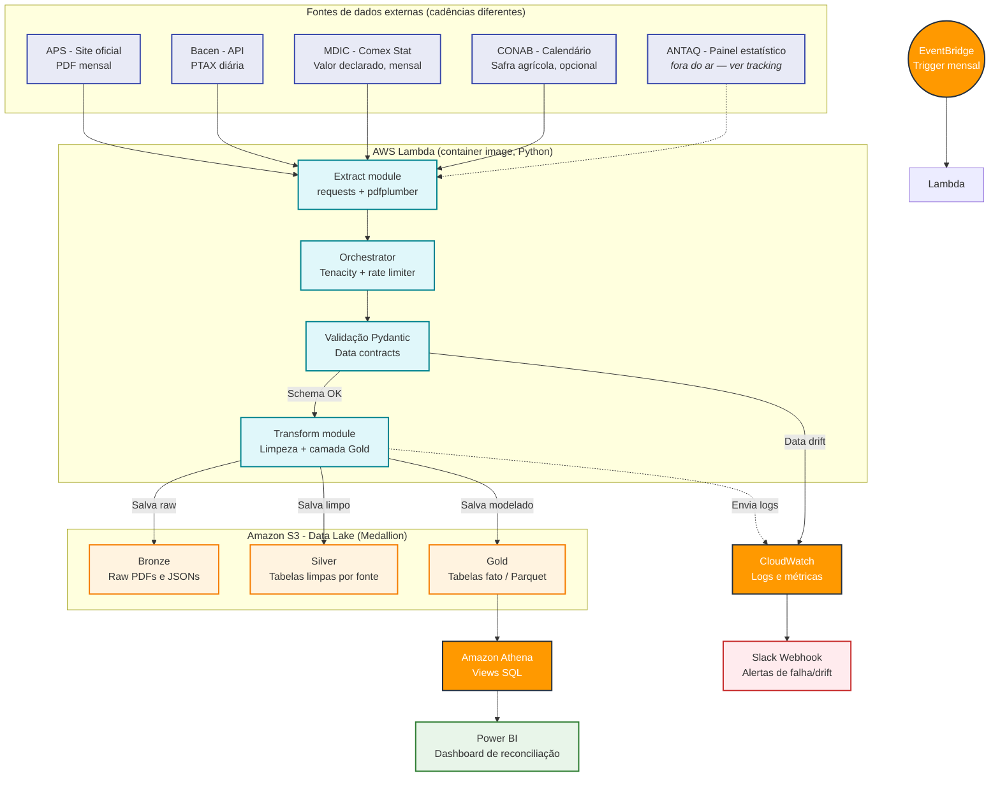

# Comex Data Product: RPA e Serverless AWS Aplicados à Balança Comercial


> Pipeline serverless de extração, validação e reconciliação de dados públicos de comércio exterior brasileiro, com estudo de caso na movimentação portuária de Santos. Todos os dados são reais e públicos — nenhum dado é simulado ou inventado.

---

## Navegação

- [Visão geral](#visão-geral)
- [Arquitetura](#arquitetura-aws-cloud-native)
- [Fontes de dados](#fontes-de-dados)
- [Modelagem da camada Gold](#modelagem-da-camada-gold)
- [Qualidade de dados e MDM](#qualidade-de-dados-e-mdm)
- [Fontes bloqueadas — tracking](#fontes-bloqueadas--tracking)
- [Decisões de design aplicadas](#decisões-de-design-aplicadas)
- [Documentação](#documentação)
- [Estrutura do projeto](#estrutura-do-projeto)
- [Status do projeto](#status-do-projeto)
- [Guia de Branches](#guia-de-branches)
- [Governança e uso responsável de dados públicos](#governança-e-uso-responsável-de-dados-públicos)
- [Acompanhando o progresso](#acompanhando-o-progresso)
- [Autor](#autor)

---

## Visão geral

Este projeto reconcilia o que o Porto de Santos registra fisicamente (toneladas movimentadas) com o que a alfândega (MDIC) registra financeiramente (valor FOB em USD), contextualizando esses números pela sazonalidade da safra (CONAB) e pela variação cambial (Bacen).

O pipeline extrai dados não estruturados de PDFs públicos, enriquece com APIs governamentais e consolida os resultados em um data lake estruturado (arquitetura medallion) na AWS. A camada Gold já processa volumes de produção reais (mais de 117 mil registros do Comex Stat em um único mês de referência; 8,86 milhões de registros na série histórica reconstruída de 2019 a 2026).

---

## Arquitetura (AWS Cloud-Native)

Compute definido como **AWS Lambda** (container image) — decisão final, não mais um alvo futuro em Fargate.



**Stack:**

| Componente | Serviço | Status |
|---|---|---|
| Orquestração | Amazon EventBridge (cron mensal) → AWS Lambda | Em produção |
| Processamento | AWS Lambda, container image (`public.ecr.aws/lambda/python`) | Em produção |
| Data lake | S3, camadas bronze/silver/gold | Em produção |
| Consulta | Amazon Athena (4 views + tabelas fato particionadas por ano) | Em produção |
| Observabilidade | Slack (webhook real) + CloudWatch | Slack em produção; SNS formal ainda roadmap |
| IaC | AWS SAM (`template.yaml`) | Em produção |

Fargate foi avaliado na fase de planejamento e descartado: o pipeline roda poucos minutos por mês, o que não justifica um cluster always-on. Lambda fora de VPC também elimina de saída o custo de NAT Gateway. Terraform foi descartado por complexidade desproporcional ao escopo (projeto solo). Ver [Decisões de design aplicadas](#decisões-de-design-aplicadas) para o raciocínio completo de cada escolha.

---

## Fontes de dados

| Fonte | O que fornece | Cadência | Formato de acesso | Status |
|---|---|---|---|---|
| Autoridade Portuária de Santos (APS) | Volume físico (t) por mercadoria e sentido | Mensal | PDF (Mensário Estatístico) | Em produção |
| Banco Central (Bacen) | PTAX (câmbio) | Diária | API pública (SGS/OData), sem chave | Em produção |
| Comex Stat (MDIC) | Valor FOB (USD) e NCM por fluxo | Mensal | API REST (`api-comexstat.mdic.gov.br`) | Em produção |
| CONAB | Produção agrícola por estado | Sazonal, irregular | Planilha `.xlsx` | Em produção — **fonte opcional**, ver [MDM](#qualidade-de-dados-e-mdm) |
| ANTAQ | Movimentação de todos os portos | Anual | Painel Qlik Sense | **Bloqueada**, ver [tracking](#fontes-bloqueadas--tracking) |

---

## Modelagem da camada Gold

Três tabelas fato, consultáveis via Athena (`docs/sql/athena_ddl.sql`):

- **`fato_movimentacao_cambio`** — volume físico por mercadoria/sentido (APS), enriquecido com PTAX média do período.
- **`fato_balanca_mdic`** — valor declarado por NCM e fluxo (MDIC), convertido para BRL pela PTAX média do mesmo período.
- **`fato_origem_agricola`** — cruzamento APS × CONAB via de-para semântico Mercadoria↔Cultura, com alocação geográfica estimada — válido apenas para o fluxo de Exportação (ver nota em Decisões de design).

Sobre essas tabelas fato, existe uma camada de views SQL no Athena (`vw_mdic_resumo_mensal`, `vw_mdic_top_paises`, `vw_mdic_top_capitulo`, `vw_origem_agricola_export`) que pré-agrega os dados para consumo direto do Power BI. **Essas views não substituem uma modelagem dimensional física** (star schema com `dim_date`, `dim_ncm`, `dim_pais` segregadas) — as tabelas fato permanecem desnormalizadas, e as views reduzem volume de linhas por consulta, não redundância de armazenamento. A única dimensão física implementada até agora é a `Dim_Calendario`, construída no próprio Power Query do dashboard (ver `docs/powerbi/checklist.md`), não no Athena.

---

## Qualidade de dados e MDM

- **Circuit breaker duplo** (`src/utils/quarantine.py`): taxa de rejeição por linha **e** cobertura de volume físico vs. total oficial declarado pelo documento fonte. Ausência do total oficial é tratada como falha estrutural (fail-closed), não como validação ignorada.
- **De-para semântico Mercadoria↔Cultura** (`src/reference/mercadoria_cultura_map.csv`), com alerta de MDM comparando as culturas do de-para contra o que de fato existe na Silver da CONAB no período.
- **Cobertura do de-para agrícola é parcial**: cobre só as culturas do Boletim de Grãos (Soja, Milho, Trigo, Arroz, Feijão). Açúcar, Álcool e Sucos Cítricos ficam de fora do `fato_origem_agricola` até um extrator dedicado a cana-de-açúcar/citros — logado explicitamente a cada execução, não falha silenciosa.
- **CONAB é fonte opcional**: sua ausência ou falha não aciona os circuit breakers nem interrompe as demais fontes. Motivo: boletins da CONAB para 2022 e 2024 aparecem como "conteúdo restrito" na plataforma da própria instituição, e há publicação duplicada para 2023 — causa fora do controle do pipeline.
- **Alocação geográfica é estimativa, não rastreamento real**: `volume_toneladas_estimado` assume que a proporção de produção nacional por estado reflete a origem do que passa por Santos, sem considerar gargalos logísticos reais. `NaN` para registros de Importação, por não fazer sentido semântico aplicar share de produção doméstica a um fluxo de entrada.

---

## Fontes bloqueadas — tracking

### ANTAQ — Painel Estatístico Aquaviário (Qlik Sense)

| Campo | Valor |
|---|---|
| Status | 🔴 Indisponível |
| Impacto no escopo | Bloqueia apenas o comparativo de market share entre portos. Não afeta nenhuma das três tabelas fato em produção. |
| Ação atual | Sem retentativa automática; integração isolada em branch não mesclada. Retomada é decisão manual. |
| Alternativas avaliadas | Base dos Dados (anuário ANTAQ tratado, granularidade anual), Boletim Estatístico Aquaviário em PDF (reaproveitaria o parser da APS), Plano de Dados Abertos da ANTAQ |

O escopo core (reconciliação APS × MDIC × CONAB × Bacen) já é entregue de ponta a ponta sem o dado da ANTAQ, que é um enriquecimento, não uma dependência estrutural da Gold.

---

## Decisões de design aplicadas

> **PDF vs. portal tabular da APS** — opção deliberada pelo PDF: demonstra parsing resiliente a mudança de layout, cenário mais próximo de Market Intelligence real.

> **Extração geométrica em vez de posicional** — `vertical_strategy: "lines"` em vez de `"text"`, após números mais largos corromperem a inferência de coluna baseada em posição textual (inclusive a linha `TOTAL GERAL`, usada pelo circuit breaker de volume).

> **Resiliência via Pydantic** — contrato de dados formal bloqueia schema divergente antes da Silver, em vez de deixar dado ruim se propagar.

> **Quarentena com circuit breaker duplo** — um único breaker por contagem de linha não protege contra perda de poucas linhas de alto peso econômico (ex.: Soja). Dois critérios independentes, e qualquer um dos dois bloqueia a ingestão.

> **De-para semântico em vez de join por string exata** — nomes de mercadoria (APS) raramente batem com nomes de cultura (CONAB) por igualdade textual; dicionário de referência versionado resolve isso sem descartar produto legítimo silenciosamente.

> **Alocação geográfica não se aplica à Importação** — share de produção doméstica não tem sentido semântico para fluxo de entrada; fica `NaN` em vez de gerar número sem significado.

> **AWS Lambda em vez de Fargate** — pipeline roda poucos minutos, uma vez por mês; Lambda fora de VPC elimina o dilema do NAT Gateway por completo, não apenas o contorna, e o consumo mensal fica bem dentro do free tier.

> **AWS SAM em vez de Terraform** — Terraform descartado por complexidade desproporcional a um projeto solo com poucos recursos.

> **Ignorar fonte indisponível em vez de bloquear a entrega** — indisponibilidade de terceiro (ANTAQ) não trava o restante do Gold; acompanhamento isolado, com data de checagem registrada.

> **Views Athena como camada de apresentação, não como substituição de star schema** — resolvem consumo do BI; a normalização física fica como decisão a avaliar (o formato colunar do Parquet reduz a penalidade de desempenho por não ter dimensões físicas, diferente de um banco relacional tradicional).

---

## Documentação

Documentação de apoio ao código, separada do README (que é o guia de navegação e status), vive em [`docs/`](./docs):

- **`docs/DOCUMENTACAO_TECNICA.md`** — arquitetura detalhada, contratos de dados por fonte, runbook operacional (sintoma → causa provável → ação), limitações conhecidas.
- **`docs/relatorio_analise_final.pdf`** — relatório de análise final em formato de trabalho técnico-científico (ABNT), com a validação estatística das hipóteses H1 (sazonalidade vs. câmbio) e H2 (reconciliação físico-financeira) sobre os 8 anos de série histórica.

- **`docs/sql/athena_ddl.sql`** — DDL das tabelas fato e das views de apresentação.
- **`docs/powerbi/`** — `comex_data_product.pbix` (fonte do dashboard), `medidas.dax`, `power_query.m`, `checklist.md` (passo a passo de conexão Athena → Power BI e criação da `Dim_Calendario`), e `exportacoes/` (PDF e vídeo do dashboard, para consulta sem abrir o Power BI Desktop).

---

## Estrutura do projeto

```bash
comex-data-product/
├── lambda_function.py           # Entrypoint de produção (AWS Lambda)
├── orchestrator.py              # Entrypoint de execução manual/local, mesmo pipeline
├── scripts/                     # Execução pontual/histórica — não roda em produção recorrente
│   ├── backfill_orchestrator.py     # Motor de backfill em lote (2019 → presente)
│   └── discover_backfill_start.py   # Sonda cada fonte para achar o piso histórico comum
├── src/
│   ├── extractors/
│   │   ├── aps_extractor.py
│   │   ├── bacen_extractor.py
│   │   ├── mdic_extractor.py
│   │   └── conab_extractor.py
│   ├── transformers/
│   │   ├── aps_cleaner.py
│   │   ├── bacen_cleaner.py
│   │   ├── mdic_cleaner.py
│   │   ├── conab_cleaner.py
│   │   └── gold_builder.py
│   ├── models/
│   │   └── contracts.py
│   ├── reference/
│   │   └── mercadoria_cultura_map.csv
│   └── utils/
│       ├── date_rules.py
│       ├── quarantine.py
│       ├── storage.py            # DataLakeConnector (S3/local)
│       └── notifier.py
├── tests/
│   ├── fixtures/aps/
│   ├── test_cleaners.py
│   ├── test_contracts.py
│   ├── test_conab_extractor.py
│   ├── test_date_rules.py
│   ├── test_extractors.py
│   └── test_mdic_extractor.py
├── docs/
│   ├── DOCUMENTACAO_TECNICA.md
│   ├── relatorio_analise_final.pdf
│   ├── sql/
│   │   └── athena_ddl.sql
│   └── powerbi/
│       ├── comex_data_product.pbix
│       ├── medidas.dax
│       ├── power_query.m
│       ├── checklist.md
│       └── exportacoes/
│           ├── comex_data_product.pdf
│           └── comex_data_product.mp4
├── Dockerfile
├── template.yaml
├── .env.example
├── .gitignore
├── LICENSE
└── requirements.txt
```

Reorganização aplicada: `scripts/` isolando os artefatos de backfill histórico da execução recorrente, PDF final substituído e renomeado em `docs/`, e o `__init__.py` órfão removido da raiz. `data/` permanece fora do controle de versão (`.gitignore`).

---

## Status do projeto

| Fase | Status |
|---|---|
| 1 — Fundação | ✅ Concluída |
| 2 — Parsing, Ingestão e Qualidade | ✅ Concluída |
| 3 — Resiliência e Observabilidade | ✅ Concluída |
| 4 — Data Lake e Camadas | ✅ Concluída, exceto ANTAQ (bloqueada por terceiro) |
| 5 — Backfill Histórico | ✅ Concluída *(pendente mover scripts para `main`, ver Estrutura do projeto)* |
| 6 — Infraestrutura como código | ✅ Concluída |
| 7 — Entrega | ✅ Concluída — Power BI e documentação final em `docs/` |

**Validação em produção (referência MAI/2026, via AWS Lambda):** pipeline completo (4 extratores → 4 cleaners → Gold Builder) em 69,4s, pico de 616MB/2048MB alocados. Circuit breakers sem intervenção: 0% de rejeição de linha em todas as fontes, 1,71% de discrepância de cobertura de volume na APS (dentro do limite de 5%).

**Validação histórica (backfill 2019–2026):** 79 lotes mensais, 8.860.902 registros de balança comercial consolidados, usados na validação estatística das hipóteses H1/H2 no relatório final.

---

## Guia de Branches

| Branch | O que introduziu |
|---|---|
| `feat/aps-parser` | Extração da tabela da APS via pdfplumber; correção `vertical_strategy` text → lines |
| `feat/bacen-parser` | Integração API Olinda (PTAX) |
| `feat/gold-layer` | Primeira versão do cruzamento APS + Bacen |
| `feat/unit-tests` | Testes com PDFs reais como fixtures |
| `feat/observability` | `DateRules` + Zona de Quarentena com circuit breakers duplos |
| `fix/cleaners-and-fixtures` | Ajustes de mapeamento de coluna pós-migração de estratégia |
| `feat/observability-slack` | Webhook real do Slack, validado em produção |
| `feat/cloud-migration-s3` | Migração de disco local para S3 (`DataLakeConnector`) |
| `feat/mdic-gold-integration` | Extração MDIC (Comex Stat), fluxos export/import |
| `feat/conab-integration` | Extração CONAB, de-para agrícola |
| `feat/antaq-integration` | Bloqueada por indisponibilidade da fonte — não mesclada |
| `feat/gold-integration-master` | Consolidação das 3 tabelas fato + DDL Athena |
| `pipeline-quality-and-mdm` | *(mesclada, branch removida)* correções de qualidade encontradas em auditoria real |
| `feat/historical-backfill` | Backfill 2019→presente, desacoplamento temporal dos extratores, particionamento Athena |
| `feat/aws-lambda-migration` | Migração de compute para AWS Lambda, validada em produção |

---

## Governança e uso responsável de dados públicos

- Respeito ao `robots.txt` e termos de uso de cada fonte.
- Rate limiting explícito entre requisições.
- Retries com backoff (Tenacity), não repetição imediata em erro.
- Nenhuma técnica de evasão de proteção anti-bot — coleta transparente e auditável.

---

## Acompanhando o progresso

Projeto construído em público, com atualizações regulares no LinkedIn a cada fase concluída.

- LinkedIn: [linkedin.com/in/magalhaes-vitor](https://www.linkedin.com/in/magalhaes-vitor/)

---

## Autor

**Vitor De Toledo Magalhães**
Desenvolvedor Python | Especialista em Automação (RPA) | Engenharia de Dados Cloud

- LinkedIn: [linkedin.com/in/magalhaes-vitor](https://www.linkedin.com/in/magalhaes-vitor/)
- GitHub: [github.com/Magalhaes-vitor](https://github.com/Magalhaes-vitor)
- E-mail: vitor.de.toledo.magalhaes@gmail.com
